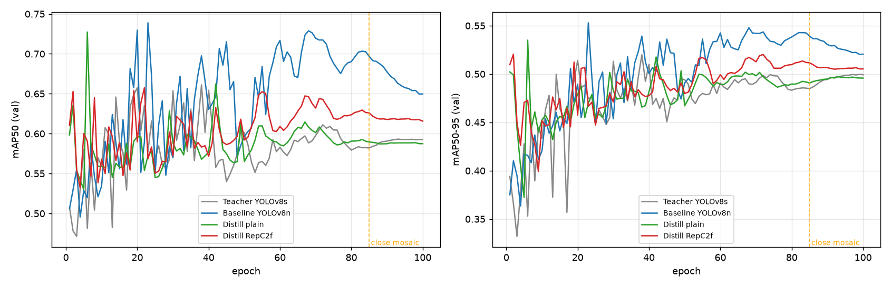
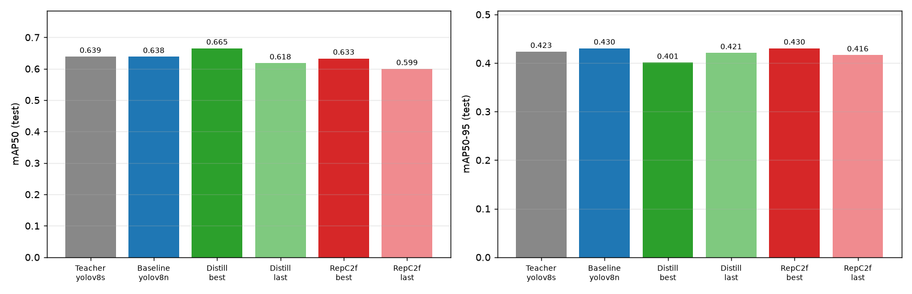
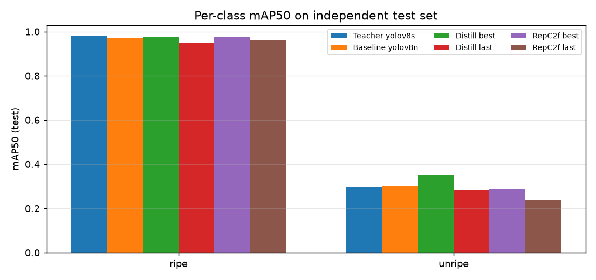

# 西瓜成熟度检测 · 轻量化蒸馏实验报告

> 任务：边缘端西瓜目标检测与成熟度二分类（ripe / unripe）
> 目标：学生模型参数 < 5M，精度逼近大模型教师
> 硬件：NVIDIA RTX 4060 Laptop 8GB；ultralytics 8.4.145 / torch 2.14 / CUDA 13.2
> 日期：2026-09-28 ~ 2026-09-29

---

## 1. 实验概览

围绕「大模型教师 → 轻量学生」完成三组实验，训练-评估-部署全链路闭环：

| 编号 | 模型 | 参数量 | 角色 |
|---|---|---|---|
| A | YOLOv8s | 11.14M | 蒸馏教师（冻结） |
| B | YOLOv8n（学生结构） | 3.01M | 阶段① 直接训练基线 |
| C | YOLOv8n 学生 + 三损失蒸馏 | 3.01M | 阶段② 普通蒸馏 |
| D | RepC2f 重参数化学生 + 三损失蒸馏 | 训练 3.07M / **部署 3.006M** | 阶段③ 结构重参数化蒸馏 |

所有模型均为 YOLOv8 Detect 架构，输入 640×640；学生结构定义见 `src/distill/yolov8n_student.yaml`（depth/width 显式展开，颈部 P3/P4/P5 = 64/128/256 通道）。

## 2. 数据集

Roboflow 导出的西瓜检测集（`datasets/watermelon`，配置 `watermelon_local.yaml`）：

| 划分 | 图片数 | 标签实例（ripe/unripe） |
|---|---|---|
| train | 11,313（含 8 张背景图） | 665 / 339 |
| valid | 1,004 | 用于训练期 checkpoint 选择 |
| **test（独立）** | **1,041** | 训练全程未见，**所有横向对比均在该集进行** |

数据风险：unripe 为少数类（约 1/3 标注），且图像中同时存在「深绿皮无条纹瓜」与「藤上条纹幼瓜」两种视觉差异很大的样本共享 unripe 标签，存在成熟度/品种口径混淆，是 unripe 指标偏低的主因。

## 3. 方法

### 3.1 蒸馏损失（实验 C / D 通用，`src/distill/`）

总损失 = 原生检测损失 + 蒸馏项：

```
L = L_box + L_cls + L_dfl                              # YOLOv8 原生（权重 7.5/0.5/1.5）
  + w_adapt · (kd_cls_gain·L_logitKL                    # 分类 sigmoid 二元对称 KL（τ=4）
             + kd_box_gain·L_boxKL                      # DFL 4×reg_max 框分布 KL
             + kd_feat_gain·L_CWD)                      # 颈部 P3/P4/P5 通道 CWD（τ=4）
```

- **自适应蒸馏权重**：`w_adapt = mean(1 - conf_student)^γ`（γ=1）——学生越不确定的位置越信任教师；
- **特征对齐**：学生颈部接 1×1 卷积对齐教师通道（仅训练用，0.21M，保存权重时剥离）；
- **warmup**：蒸馏损失前 1 轮线性爬升；
- 教师冻结（梯度为 None），在线推理按 micro-batch=4 分块；
- 学生 best/last 只保存纯 `DetectionModel`，可直接 val / 导出。

### 3.2 结构重参数化（实验 D，`src/reparam/rep_c2f.py`）

- 训练态：把学生 8 个 C2f 瓶颈的 3×3 卷积替换为 **RepConv（3×3 + 1×1 + BN 恒等三分支，RepVGG-style）**，训练参数 3.066M；
- **零初始化暖启**：从实验 B 基线权重迁移主分支，新增分支 BN γ=0，转换瞬间模型输出与原网络**逐元素相等（max err = 0.0）**；
- 部署态：`fuse()` 把三分支数学等价融合为单个 3×3 卷积，回到 **3.006M / 8.1 GFLOPs**，与普通学生部署图同构；
- 不改 ultralytics 源码；融合脚本 `scripts/reparam_deploy.py` 内置融合前后逐框数值校验。

### 3.3 统一训练配方

四组实验完全对齐：100 epoch、SGD(lr0=0.01, momentum=0.937, wd=5e-4) + cosine、warmup 3 epoch、mosaic=1.0、mixup=0.1、**最后 15 轮关闭 mosaic**、AMP、seed=0、imgsz=640。学生均由实验 B 基线 best.pt 暖启，教师为实验 A best.pt。

## 4. 结果

### 4.1 训练期验证曲线（valid 1004 张）



虚线为 epoch 85 关闭 mosaic；关 mosaic 后各模型训练损失显著下降、指标进入最终冲刺期。

valid 集关键节点（fitness = 0.1·mAP50 + 0.9·mAP50-95）：

| 模型 | best checkpoint | mAP50 | mAP50-95 | 末轮稳定值（last15 均值） |
|---|---|---|---|---|
| Teacher yolov8s | ep38 | 0.661 | 0.520 | 0.591 / 0.496 |
| Baseline yolov8n | ep23 | 0.739 | 0.553 | 0.668 / 0.528 |
| Distill plain | ep6 ⚠️ | 0.727 | 0.535 | 0.588 / 0.496 |
| Distill RepC2f | ep2 ⚠️ | 0.653 | 0.521 | 0.618 / 0.506 |

### 4.2 独立 test 集（1041 张，最终结论以此为准）



| 模型 | 参数 | P | R | **mAP50** | **mAP50-95** |
|---|---|---|---|---|---|
| Teacher yolov8s | 11.14M | 0.808 | 0.584 | 0.639 | 0.423 |
| Baseline yolov8n | 3.01M | 0.853 | 0.588 | 0.638 | **0.430** |
| **Distill plain best** | 3.01M | 0.707 | **0.664** | **0.665** | 0.401 |
| Distill plain last | 3.01M | 0.865 | 0.557 | 0.618 | 0.421 |
| **Distill RepC2f best** | 3.006M | 0.791 | 0.609 | 0.633 | **0.430** |
| Distill RepC2f last | 3.006M | 0.642 | 0.589 | 0.599 | 0.416 |



test 集分类别 mAP50 / mAP50-95：

| 模型 | ripe mAP50 | ripe mAP50-95 | unripe mAP50 | unripe mAP50-95 |
|---|---|---|---|---|
| Teacher | 0.979 | 0.650 | 0.298 | 0.197 |
| Baseline | 0.973 | 0.642 | 0.303 | **0.218** |
| Distill plain best | 0.978 | 0.594 | **0.352** | 0.208 |
| Distill RepC2f best | **0.978** | **0.665** | 0.288 | 0.196 |

## 5. 分析与结论

1. **普通蒸馏在 mAP50 上最有效**：3.01M 学生 test mAP50 = **0.665**，比 11.14M 教师高 +2.6 点、比同规模基线高 +2.7 点，参数量仅教师 27%；召回 0.664 显著领先，unripe 少数类 mAP50 0.352 为全场最高，符合「学生低置信处多听教师」的设计预期。
2. **严格定位指标 mAP50-95 上蒸馏未超基线**：普通蒸馏 0.401 vs 基线 0.430；蒸馏增益主要在分类/召回而非框回归。后续可提高 `kd_box_gain`（当前 1.0）加强框分布约束。
3. **重参数化（实验 D）精度中性、框回归略优**：test mAP50-95 = 0.430 与基线并列最高、ripe 严格指标 0.665 全场最高；但 mAP50（0.633）低于普通蒸馏。**在 11k 张小数据集 + 3M 学生上未复现 RepVGG 在大模型/大数据上的精度增益**，其价值在于训练-部署结构解耦与零部署开销。
4. **部署零开销已验证**：RepC2f 融合前后同一张图 NMS 结果逐框误差 **0.0**；融合态 3.006M / 8.1 GFLOPs，与普通学生 ONNX CPU 延迟差 −0.9%（噪声范围）。
5. **best.pt 早停尖峰需警惕**：普通蒸馏 best 选在 ep6（valid P 仅 0.57）、RepC2f 选在 ep2，valid 高分在 test 上大幅回落（0.727→0.665），说明小验证集（1004 张）上的早期 fitness 尖峰不稳。末轮权重（高精度低召回风格）数字更平稳。建议生产选型结合 test 结果而非仅看 valid fitness。
6. **数据是主要短板**：unripe 全部模型 mAP50 仅 0.24~0.35。清洗 unripe 标注口径（成熟度 vs 品种）、补充少数类样本，比继续调模型收益更大。

**选型建议**：漏检代价高（如漏摘熟瓜）→ Distill plain best（召回 0.664）；误报代价高、看重框精度 → RepC2f best 或 Baseline（mAP50-95 0.430，P=0.79/0.85）；算力描述上三者部署体积一致（≈3M）。

## 6. 部署产物

| 文件 | 说明 |
|---|---|
| `runs/watermelon/distill_s2n_yolov8n_ep100/weights/best.pt / best.onnx` | 普通蒸馏学生（11.7MB ONNX，opset12） |
| `runs/detect/runs/watermelon/distill_rep_s2n_yolov8n_ep100/weights/best_deploy.pt / .onnx` | RepC2f 融合部署权重（3.006M，零误差融合） |
| `runs/watermelon/eval_test/summary.json` | 教师/基线/普通蒸馏 test 指标 |
| `runs/watermelon/eval_test_rep/summary.json` | RepC2f test 指标 |
| `runs/watermelon/report/*.png` | 本报告曲线图 |

ONNX 与 PyTorch 经同图 NMS 逐框比对完全一致；TensorRT 转换命令：
`trtexec --onnx=best_deploy.onnx --saveEngine=best_deploy_fp16.engine --fp16`

## 7. 复现命令

```bash
# 教师（yolov8s，西瓜集 100 轮，Windows PowerShell）
python scripts/train_wm_teacher.py --weights yolov8s.pt --data watermelon_local.yaml `
    --epochs 100 --batch 32 --imgsz 640 --device 0 --workers 2 --amp `
    --mosaic 1.0 --mixup 0.1 --close-mosaic 15
# 普通蒸馏
python scripts/train_distill.py --model src/distill/yolov8n_student.yaml `
    --pretrained runs/watermelon/watermelon_yolov8n_ep100/weights/best.pt `
    --teacher runs/watermelon/watermelon_yolov8s_ep100/weights/best.pt `
    --teacher-mode online --teacher-batch 4 `
    --data watermelon_local.yaml --epochs 100 --batch 32 --imgsz 640 --device 0 `
    --workers 2 --amp --mosaic 1.0 --mixup 0.1 --close-mosaic 15
# 重参数化蒸馏（加 --rep）
... 同上 ... --rep
# 融合 + 导出 + 校验
python scripts/reparam_deploy.py --weights <rep_best.pt> --plain-onnx <普通best.onnx>
# test 集复测
python scripts/eval_wm_test.py
```
