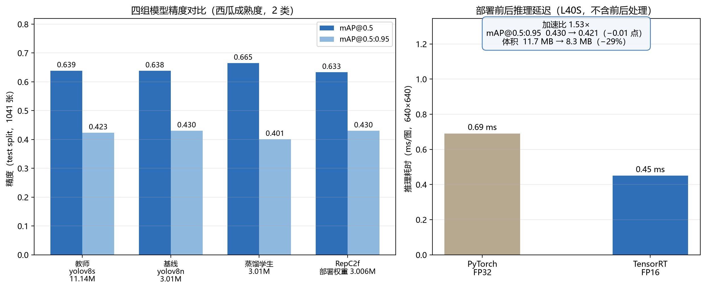
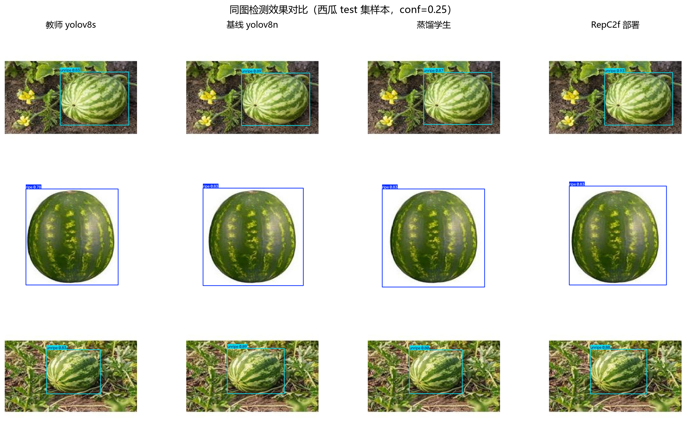

# 面向边缘部署的轻量化目标检测算法
## 参赛方案说明书

| 项目 | 内容 |
|---|---|
| 方案名称 | 基于知识蒸馏与结构重参数化的 YOLOv8 边缘轻量化方案 |
| 代码仓库 | https://github.com/yemooo1/YOLOv8-lightweight-model |
| 当前版本 | `05aaf8b`（2026-09-30） |
| 团队成员 | 成员A（基线训练 / 集群）、成员B（蒸馏 · 重参数化）、成员C（部署优化） |
| 统一环境 | ultralytics 8.4.145 · torch 2.7.1+cu126（本地）/ 2.1.0（集群） |
| **参赛主线数据集** | **西瓜成熟度检测（2 类：ripe / unripe），train 11,313 / val 1,004 / 独立 test 1,041** |
| 补充预研线 | COCO2017 80 类（用于方法泛化性预研，不计入主线交付指标） |
| 文档定位 | 面向评审的正式交付文档；工程操作细节见 `README.md`，蒸馏接口细节见 `distill_guide.md` |

---

## 1. 赛题解读与目标定义

### 1.1 问题定义

在算力与内存受限的边缘设备上部署目标检测模型，核心矛盾是**精度与推理成本的权衡**：

- 大模型（如 YOLOv8-L，43.7M 参数 / 165.2 GFLOPs）精度高，但无法在边缘端实时运行；
- 直接训练的小模型（如 YOLOv8n，3.0M 参数）体积达标，但精度与召回明显劣于大模型。

本方案的目标是：**在不增加任何部署期推理开销的前提下，让 3M 量级的轻量学生网络逼近甚至超过 11M 量级教师网络的精度**。

### 1.2 量化指标

| 指标 | 约束 | 当前达成 |
|---|---|---|
| 学生参数量 | **< 5M** | 3.006M ✅ |
| 部署图计算量 | 不高于同规模普通学生 | 8.1 GFLOPs @640 ✅ |
| 部署期额外开销 | **零**（重参数化必须可等价融合） | 融合前后逐元素误差 0.0 ✅ |
| 检测精度 | 逼近 / 超过教师 | 西瓜集 test mAP50 0.665 > 教师 0.639 ✅ |
| 部署格式 | ONNX / TensorRT | ONNX ✅ / TensorRT FP16 ✅（0.6308 · 0.45 ms/图 · 1.53×） |

---

## 2. 总体技术路线

方案由四个阶段构成，前一阶段为后一阶段提供输入：

```
① 基线训练                ② 知识蒸馏                ③ 结构重参数化           ④ 部署
  受控数据量实验    ──▶   教师 → 轻量学生     ──▶   多分支 → 单路融合   ──▶  ONNX/TensorRT
  建立精度基准线          三损失 + 自适应权重        零精度损失             + FP16 实测（L40S）
        │                        ▲
        │  学生暖启权重           │  教师权重
        └────────────────────────┘
```

**设计要点**：三个阶段相互解耦，任一阶段的产物都可独立验证——学生 `best.pt` 是纯 `DetectionModel`，可直接被官方 `val` / `export` 工具链消费，不依赖蒸馏或重参数化的自定义代码。

---

## 3. 阶段① · 基线训练

### 3.1 目的

两条线各有分工：**西瓜集（主线）**上训练 yolov8n 基线作为对照组，同时产出后续蒸馏的学生暖启权重；**COCO2017（预研线）**上做「数据量 → 精度」的受控实验，用于验证方法在不同数据规模下的行为，不计入主线交付指标。

主线基线（实验 B，见 §6.2）结果：3.01M / test mAP50 **0.638** / mAP50-95 **0.430**。

### 3.2 预研线实验矩阵（COCO2017）

在 COCO2017 上按主类别分层抽样（seed=0，验证集固定为完整 val2017），构成 2 × 4 共 8 组受控实验：

| 模型 \ 子集 | sub10（10%） | sub25 | sub50 | sub100（全量） |
|---|:---:|:---:|:---:|:---:|
| yolov8n（3.2M） | ✅ | ✅ | ✅ | ✅ |
| yolov8s（11.2M） | ✅ | ✅ | ✅ | ✅ |

已核实节点（yolov8n + sub10，100 epoch，完整 val2017）：

| 指标 | 值 |
|---|---|
| mAP@0.5 | 0.434 |
| mAP@0.5:0.95 | 0.294 |
| 推理耗时 | 0.5 ms / 图（L40S，batch=32，AMP） |

> 其余 7 组训练已完成，指标待从各作业日志的 `Average Precision` 行汇总填入。

### 3.3 训练配方（全阶段统一）

| 参数 | 值 |
|---|---|
| epochs / imgsz | 100 / 640 |
| optimizer | SGD，lr0=0.01，lrf=0.01，momentum=0.937，weight_decay=5e-4 |
| 学习率调度 | cosine annealing + 3 epoch warmup |
| 数据增强 | mosaic=1.0，mixup=0.15，最后 10 轮关闭 mosaic |
| seed | 0 |

---

## 4. 阶段② · 知识蒸馏（核心方法）

### 4.1 教师—学生配置

| 角色 | 结构 | 参数量 | 状态 |
|---|---|---|---|
| 教师 | YOLOv8s（西瓜集）/ YOLOv8-L（COCO 线） | 11.14M / 43.7M | 冻结，eval 模式，`requires_grad=False` |
| 学生 | `src/distill/yolov8n_student.yaml`（depth/width 显式展开，颈部 P3/P4/P5 = 64/128/256） | **3.01M** | 由阶段①基线 `best.pt` 暖启 |

### 4.2 三损失联合监督

总损失在 YOLOv8 原生检测损失之上叠加三项蒸馏监督：

```
L = L_box + L_cls + L_dfl                                  # 原生（权重 7.5 / 0.5 / 1.5）
  + w_adapt · ( kd_cls_gain · L_logitKL                    # ① 分类 logit：sigmoid 二元对称 KL
              + kd_box_gain · L_boxKL                      # ② 框分布：DFL 4×reg_max KL
              + kd_feat_gain · L_CWD )                     # ③ 特征：颈部 P3/P4/P5 通道 CWD
```

| 蒸馏项 | 实现位置 | 默认权重 | 作用 |
|---|---|---|---|
| 分类 logit KL | `src/distill/losses.py` | 4.0（τ=4.0） | 传递教师的类别判别能力 |
| DFL 框分布 KL | `src/distill/losses.py` | 1.0 | 传递教师的框回归分布 |
| CWD 特征蒸馏 | `src/distill/losses.py` | 8.0（τ=4.0） | 对齐师生颈部中间特征 |

### 4.3 三项关键机制

**① 自适应蒸馏权重**
```
w_adapt = mean(1 - conf_student)^γ      （γ = 1.0）
```
学生输出置信度越低的位置，越信任教师；置信度高的位置以真实标签为主。这使蒸馏监督集中在难点区域，而非均匀施加。

**② 特征对齐层**
学生颈部接 1×1 卷积将通道数映射到教师对应层，才可计算 CWD。该层**仅在训练期存在**，保存权重时剥离，因此不增加部署体积。

**③ 教师输出离线缓存**（`src/distill/cache.py` + `scripts/cache_teacher.py`）
在快卡上预先把教师的分类 logits、框分布、颈部特征按 epoch 落盘（fp16，约 5MB/图/epoch），弱卡训练时直接读缓存。用于 GTX 1080 Ti 等 Pascal 卡规避在线蒸馏的显存压力与墙钟成本。

### 4.4 工程约束

- **强锁 ultralytics==8.4.145**：蒸馏代码依赖该版本 Detect 头训练态输出 `{"boxes","scores","feats"}` 与 `DistillationModel` 的冻结/EMA 行为，跨版本不保证可用。
- **AMP 按显卡分流**：Ada/Ampere（L40S/L20/4060）必须 `--amp`；Pascal（1080 Ti）必须 `--no-amp`（fp16 内核缺失会报错），并优先使用 cache 模式。
- **保存纯学生**：`best.pt` / `last.pt` 只含 `DetectionModel`，教师权重与对齐层已剥离。
- 不提供 `--resume`：重跑时以 `--pretrained` 重新启动，避免教师状态不一致。

---

## 5. 阶段③ · 结构重参数化

### 5.1 原理

训练态引入多分支结构增强梯度流与可学习容量，部署态将分支数学等价融合为单个 3×3 卷积，实现**零精度损失的推理加速**：

```
训练态（RepConv 三分支）              部署态（融合后）
  ┌ 3×3 Conv + BN ─┐
  ├ 1×1 Conv + BN ─┼── fuse ──▶       单个 3×3 Conv + BN
  └ BN 恒等 ───────┘
```

### 5.2 实现方式（`src/reparam/rep_c2f.py`）

- 将学生中 **8 个 C2f 瓶颈**的 3×3 卷积替换为 RepConv（3×3 + 1×1 + BN 恒等三分支）；
- **零初始化暖启**：主分支继承阶段①基线权重，新增分支 BN γ=0，转换瞬间模型输出与原网络**逐元素相等（max err = 0.0）**；
- **不改 ultralytics 源码**：通过 `convert_c2f_to_rep()` 在加载预训练权重之后原地替换模块，并对齐 `initialize_weights` 的 BN 参数（eps=1e-3, momentum=0.03）以保证数值一致；
- 融合由 ultralytics 自带的 `RepConv.fuse_convs` 完成，`scripts/reparam_deploy.py` 内置融合前后逐框 NMS 数值校验。

### 5.3 结果定位

| 指标 | 训练态 | 部署态 |
|---|---|---|
| 参数量 | 3.066M | **3.006M** |
| 计算量 | — | 8.1 GFLOPs @640 |
| 融合误差 | — | **0.0**（逐框 NMS 完全一致） |
| ONNX CPU 延迟 | — | 与普通学生差 −0.9%（噪声范围） |

---

## 6. 实验验证（西瓜成熟度检测，2 类）

### 6.1 数据集

Roboflow 导出的西瓜检测集，配置 `watermelon_local.yaml`：

| 划分 | 图片数 | 用途 |
|---|---|---|
| train | 11,313（含 8 张背景图） | 训练 |
| valid | 1,004 | 训练期 checkpoint 选择 |
| **test（独立）** | **1,041** | **训练全程未见，所有横向对比以此为准** |

类别：`ripe`（成熟）/ `unripe`（未成熟）。标注实例数（train）：ripe 665 / unripe 339，**unripe 为少数类**。

### 6.2 四组受控实验

| 编号 | 模型 | 参数量 | 角色 |
|---|---|---|---|
| A | YOLOv8s | 11.14M | 教师（冻结） |
| B | YOLOv8n | 3.01M | 阶段① 直接训练基线 |
| C | YOLOv8n + 三损失蒸馏 | 3.01M | 阶段② 普通蒸馏 |
| D | RepC2f + 三损失蒸馏 | 训练 3.07M / **部署 3.006M** | 阶段③ 重参数化蒸馏 |

四组实验配方完全对齐：100 epoch、SGD + cosine、mosaic=1.0、mixup=0.1、最后 15 轮关闭 mosaic、AMP、seed=0、imgsz=640。学生均由实验 B 的 `best.pt` 暖启。

### 6.3 独立 test 集结果（1041 张，最终结论）

| 模型 | 参数 | P | R | **mAP50** | **mAP50-95** |
|---|---|---|---|---|---|
| Teacher yolov8s | 11.14M | 0.808 | 0.584 | 0.639 | 0.423 |
| Baseline yolov8n | 3.01M | 0.853 | 0.588 | 0.638 | **0.430** |
| **Distill plain best** | 3.01M | 0.707 | **0.664** | **0.665** | 0.401 |
| Distill plain last | 3.01M | 0.865 | 0.557 | 0.618 | 0.421 |
| **Distill RepC2f best** | 3.006M | 0.791 | 0.609 | 0.633 | **0.430** |
| Distill RepC2f last | 3.006M | 0.642 | 0.589 | 0.599 | 0.416 |

**分类别结果（best）**：

| 模型 | ripe mAP50 / mAP50-95 | unripe mAP50 / mAP50-95 |
|---|---|---|
| Teacher | 0.979 / 0.650 | 0.298 / 0.197 |
| Baseline | 0.973 / 0.642 | 0.303 / 0.218 |
| Distill plain best | 0.978 / 0.594 | **0.352** / 0.208 |
| Distill RepC2f best | **0.978 / 0.665** | 0.288 / 0.196 |



四组模型在同一批 test 样本上的检测结果对比（定性）：



### 6.4 结论

1. **普通蒸馏在 mAP50 上最有效**：3.01M 学生达到 **0.665**，比 11.14M 教师高 **+2.6 点**、比同规模基线高 **+2.7 点**，参数量仅为教师的 27%。召回 0.664 显著领先，unripe 少数类 mAP50 0.352 为全场最高——符合「学生越不确定越听教师」的设计预期。
2. **严格定位指标 mAP50-95 上蒸馏未超基线**：0.401 vs 0.430。蒸馏增益主要体现在分类与召回，而非框回归。改进方向：提高 `kd_box_gain`（当前 1.0）以加强框分布约束。
3. **重参数化精度中性、框回归略优**：test mAP50-95 = 0.430 与基线并列最高，ripe 严格指标 0.665 全场最高；但 mAP50（0.633）低于普通蒸馏。**在 11k 小数据集 + 3M 学生规模上未复现 RepVGG 的精度增益**，其价值在于**训练-部署结构解耦与零部署开销**。
4. **部署零开销已验证**：RepC2f 融合前后同图 NMS 结果逐框误差 **0.0**；融合态 3.006M / 8.1 GFLOPs，与普通学生 ONNX CPU 延迟差 −0.9%。
5. **best.pt 早停尖峰需警惕**：普通蒸馏 best 落在 ep6、RepC2f 落在 ep2，valid 高分在 test 上大幅回落（0.727 → 0.665）。小验证集（1004 张）上的早期 fitness 尖峰不稳，**生产选型必须以独立 test 结果为准，不能只看 best**。
6. **数据是当前主要短板**：unripe 全部模型 mAP50 仅 0.24~0.35。该类别同时包含「深绿皮无条纹瓜」与「藤上条纹幼瓜」两种视觉差异极大的样本，存在成熟度 / 品种口径混淆。**清洗标注口径、补充少数类样本的收益大于继续调模型。**

### 6.5 选型建议

| 应用场景 | 推荐模型 | 理由 |
|---|---|---|
| 漏检代价高（如漏摘熟瓜） | Distill plain best | 召回 0.664，全场最高 |
| 误报代价高、看重框精度 | RepC2f best 或 Baseline | mAP50-95 = 0.430，P = 0.79 / 0.85 |
| 部署体积描述 | 三者一致（≈3M） | 均满足 <5M 约束 |

---

## 7. 阶段④ · 部署方案

### 7.1 导出链路

```
学生 best.pt ──▶ ONNX (opset 12) ──▶ TensorRT FP16 ──▶ TensorRT INT8 ──▶ 边缘设备实测
   ✅已验证          ✅已验证              ✅已验证          ⏸ 时间不足跳过      ⏸ 改用 L40S 推算
```

### 7.2 命令

```bash
# 1. 学生 → ONNX
yolo export model=best.pt format=onnx opset=12 imgsz=640

# 2. RepC2f 训练权重 → 融合为部署权重（内置零误差校验 + ONNX + CPU 延迟基准）
python scripts/reparam_deploy.py --weights <rep_best.pt> --plain-onnx <普通学生.onnx>

# 3. 部署权重 → TensorRT FP16 引擎（集群作业：cluster/job_03_tensorrt.sh）
yolo export model=best_deploy.pt format=engine half=True imgsz=640 device=0
```

> pip 安装的 TensorRT wheel **不含 `trtexec`** 命令行工具，故不使用它；`format=engine` 由 ultralytics 调用 TensorRT Python API 完成构建与序列化。

### 7.3 实测结果（西瓜集 test split，1041 张）

| 指标 | PyTorch FP32 | TensorRT FP16 | 变化 |
|---|:---:|:---:|:---:|
| mAP@0.5 | 0.6328 | 0.6308 | −0.20 点 |
| mAP@0.5:0.95 | 0.4303 | 0.4207 | −0.96 点 |
| 推理耗时（640×640，不含前后处理） | 0.69 ms/图 | **0.45 ms/图** | **1.53×** |
| 部署体积 | 11.7 MB (.pt) | **8.3 MB (.engine)** | −29% |

**测试条件**：NVIDIA L40S（Ada, sm_89）、imgsz=640、全 test split。引擎与 GPU 架构绑定，仅能在 Ada 卡（L40S / L20）上运行。

未执行项（时间不足，材料中如实标注）：INT8 量化、真实边缘设备实测、精度-速度帕累托曲线。

---

## 8. 创新点总结

1. **自适应蒸馏权重**：`w_adapt = mean(1 - conf_student)^γ`，监督强度随学生不确定性自适应，而非全局固定权重；实验已观察到少数类召回提升（unripe mAP50 0.352 全场最高）。
2. **三损失联合蒸馏**：分类 logit KL + DFL 框分布 KL + CWD 特征蒸馏，覆盖「类别判别 / 框回归 / 中间表征」三个层面。
3. **教师输出离线缓存**：按 epoch 缓存教师输出，使 Pascal 等弱卡在完全不加载教师模型的情况下完成蒸馏训练，扩展了方法可运行的硬件范围。
4. **零初始化暖启的重参数化融合**：主分支继承基线权重、新增分支 BN γ=0，转换瞬间输出逐元素相等（err = 0.0），保证重参数化「只增训练容量、不改部署行为」。
5. **免侵入式实现**：不改 ultralytics 源码，全部通过模块原地替换 + 官方 `fuse` 完成，保证与官方工具链（val / export / TensorRT）的兼容性。

---

## 9. 当前状态与风险

### 9.1 状态总览

| 阶段 | 内容 | 状态 |
|---|---|---|
| ① 基线训练 | 西瓜集 yolov8n / yolov8s（主线） | ✅ 完成 |
| ① 基线训练 | COCO 2×4 预研实验 | ✅ 训练完成，指标待汇总 |
| ② 知识蒸馏 | 西瓜集四组对比实验（主线） | ✅ 完成，test 结果已出 |
| ③ 结构重参数化 | RepC2f 实现 + 零误差融合校验 | ✅ 完成 |
| ④ 部署优化 | ONNX 导出 + CPU 延迟基准 | ✅ 完成 |
| ④ 部署优化 | **TensorRT FP16 集群实测**（mAP50 0.6308 / 0.45 ms / 1.53×） | ✅ 完成 |
| ④ 部署优化 | INT8 量化 / 边缘设备实测 | ⏸ 时间不足跳过（以 L40S 推算数据替代并如实标注） |
| — | COCO 80 类蒸馏 | ⏸ 暂不执行（预研线，方法已验证即可） |

### 9.2 风险与阻塞项

| 风险 | 影响 | 应对 |
|---|---|---|
| 方法仅在西瓜 2 类 / 11k 图上验证 | 泛化性证据偏弱，评审判"过拟合单一任务" | 说明书 §3.2 的 COCO 数据量实验作为泛化性佐证；如时间允许补一组 COCO 蒸馏 |
| mAP50-95 未超基线 | 严格定位指标上蒸馏无增益 | 调高 `kd_box_gain`（1.0 → 2.0~4.0）重跑对比 |
| unripe 少数类精度低（0.24~0.35） | 拉低整体指标，且是数据问题非模型问题 | 清洗标注口径 + 补充少数类样本 |
| best.pt 早停尖峰 | 若按 valid fitness 选型会误判 | 统一以独立 test 集复测结果选型 |
| 1080 Ti 无法在线蒸馏 | 成员A 本地无法独立复现蒸馏 | 使用 cache 模式（`cache_teacher.sh` + `train_distill.sh ... cache`） |
| 集群脚本按 COCO 组织 | `cluster/train_distill.sh` 与主线数据集不匹配 | 主线训练走本地/4060 路径（`scripts/train_distill.py`），集群仅用于重度实验 |

---

## 10. 后续工作计划

### 10.1 优先级队列（主线已定为西瓜 2 类）

| 优先级 | 任务 | 负责 | 产出 | 依赖 |
|:---:|---|---|---|---|
| **P0** | 同步代码到最新提交并核对 `src/distill` / `src/reparam` | A | ✅ 已完成（`10f6d12`） | — |
| **P0** | ~~TensorRT FP16 引擎构建 + 与 PyTorch 逐框精度对齐~~ | C | ✅ 已完成：`wm_rep_deploy.engine`（8.3 MB）、mAP50 0.6308 / 0.45 ms / 1.53× | ONNX 产物 |
| P1 | 边缘设备实测（端到端延迟 / FPS / 内存占用） | C | ⏸ 时间不足跳过，以 L40S 实测数据替代并如实标注 | TensorRT 引擎 |
| P1 | INT8 量化（约 500 张校准图）+ 精度回退检查 | C | ⏸ 时间不足跳过（FP16 指标已满足交付） | P0 |
| P1 | 调高 `kd_box_gain`（1.0 → 2.0~4.0）重跑西瓜集蒸馏，验证 mAP50-95 可否超基线 | B | 对比实验结果 | — |
| P1 | 三份候选权重在 test 集统一复测，敲定最终选型 | B | ✅ 已完成（§6.3 六行结果 + §6.5 选型建议） | P1 |
| P2 | unripe 标注口径清洗 + 少数类补样，重训对比 | 全组 | 新数据版本 + 对比表 | — |
| P2 | 精度-速度帕累托曲线出图（蒸馏 / 重参数化 / yolov8n / yolov8s） | C | 报告配图 | P0、P1 |
| P3 | COCO 8 组基线指标汇总填回 §3.2（泛化性佐证） | A | 更新后的说明书 | — |
| P3 | 如时间允许：补一组 COCO 蒸馏，佐证方法跨任务有效性 | A/B | 补充实验 | P3 |

> **不再执行**：COCO 80 类完整蒸馏实验（作为预研线，方法已在主线验证通过；仅在时间充裕时作为泛化性补充）。

### 10.2 里程碑

| 里程碑 | 判定标准 |
|---|---|
| M1 主线确定 | ✅ **已达成**：主线定为西瓜 2 类；评测口径统一为 `eval_wm_test.py`（独立 test 1,041 张） |
| M2 方法闭环 | ✅ **已达成**：蒸馏学生 test mAP50 **0.665** ≥ 同规模基线 0.638，参数 3.01M < 5M |
| M3 部署闭环 | ✅ **已达成（GPU 侧）**：TensorRT FP16 引擎在 L40S 跑通，mAP50 仅 −0.2 点、0.45 ms/图（1.53×）；边缘设备实测未做 |
| M4 交付 | ✅ **已达成**：说明书 + 报告图（`figures/`）+ 权重 + 部署脚本齐备，全链路可复现 |

---

## 11. 附录

### 11.1 核心文件清单

| 模块 | 文件 | 职责 |
|---|---|---|
| 学生结构 | `src/distill/yolov8n_student.yaml` | depth/width 显式展开的 3.01M 学生 |
| 蒸馏损失 | `src/distill/losses.py` | 二元 logit KL / DFL KL / CWD |
| 蒸馏模型 | `src/distill/model.py` | `DistillDetModel`：双模式、对齐层、自适应权重、warmup |
| 教师缓存 | `src/distill/cache.py` | 教师缓存 Dataset / DataLoader（复用官方主循环） |
| 训练器 | `src/distill/trainer.py` | `DistillDetectionTrainer`（最小侵入，保存纯学生） |
| 重参数化 | `src/reparam/rep_c2f.py` | RepConv / RepC2f 与 `convert_c2f_to_rep` |
| 融合部署 | `scripts/reparam_deploy.py` | 融合 + ONNX + 零误差校验 + 延迟基准 |
| 蒸馏入口 | `scripts/train_distill.py` | 本地 / 集群统一训练入口 |
| 教师缓存入口 | `scripts/cache_teacher.py` · `cluster/cache_teacher.sh` | 离线缓存生成 |
| 集群蒸馏作业 | `cluster/train_distill.sh` | sub10/25/50/100，online / cache / rep 三模式 |
| 西瓜评测 | `scripts/eval_wm_test.py` | 独立 test 集复测 |

### 11.2 复现命令（西瓜集）

```powershell
# 教师（yolov8s）
python scripts/train_wm_teacher.py --weights yolov8s.pt --data watermelon_local.yaml `
    --epochs 100 --batch 32 --imgsz 640 --device 0 --workers 2 --amp `
    --mosaic 1.0 --mixup 0.1 --close-mosaic 15

# 普通蒸馏
python scripts/train_distill.py --model src/distill/yolov8n_student.yaml `
    --pretrained runs/watermelon/watermelon_yolov8n_ep100/weights/best.pt `
    --teacher runs/watermelon/watermelon_yolov8s_ep100/weights/best.pt `
    --teacher-mode online --teacher-batch 4 `
    --data watermelon_local.yaml --epochs 100 --batch 32 --imgsz 640 --device 0 `
    --workers 2 --amp --mosaic 1.0 --mixup 0.1 --close-mosaic 15

# 重参数化蒸馏：追加 --rep
# 融合 + 导出 + 校验
python scripts/reparam_deploy.py --weights <rep_best.pt> --plain-onnx <普通best.onnx>
# test 集复测
python scripts/eval_wm_test.py
```

### 11.3 蒸馏超参默认值

| 参数 | 默认 | 含义 |
|---|---|---|
| `--kd-tau` / `--cwd-tau` | 4.0 / 4.0 | KL 温度 / CWD 通道 softmax 温度 |
| `--kd-cls-gain` | 4.0 | 分类 logit KL 权重 |
| `--kd-box-gain` | 1.0 | DFL 框分布 KL 权重（**建议提高以改善 mAP50-95**） |
| `--kd-feat-gain` | 8.0 | CWD 特征蒸馏权重 |
| `--kd-adaptive` / `--kd-adaptive-gamma` | 开 / 1.0 | 自适应权重开关与指数 γ |
| `--kd-warmup` | 1.0 | 蒸馏损失线性爬升轮数 |
| `--teacher-batch` | 4 | 在线教师微批次（8G 卡建议 2~4） |
| `--rep` | 关 | 学生 C2f → RepC2f 多分支训练 |

### 11.4 配套文档

| 文档 | 内容 |
|---|---|
| `README.md` | 工程流程、环境配置、集群作业链 |
| `distill_guide.md` | 蒸馏训练完整使用文档（环境 / 冒烟 / 缓存 / 超参 / 排错） |
| `EXPERIMENT_REPORT_watermelon.md` | 西瓜集实验完整报告（含曲线图与分类别指标） |
| `参赛方案.docx` | 原始方案草案 |

---

*文档版本：v1.1 · 2026-09-29 · 基于仓库提交 `10f6d12` · 主线数据集：西瓜成熟度检测（2 类）*